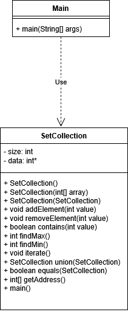

# SetCollection — Лабораторная работа по Java

Проект реализует структуру данных **"множество"** на языке Java с полным набором операций: добавление, удаление, проверка, объединение и другие.

---

## Содержание

- [Описание](#описание)
- [Возможности](#возможности)
- [Структура проекта](#структура-проекта)
- [UML-диаграмма](#uml-диаграмма)
- [Примеры работы](#примеры-работы)

---

## Описание

Класс `SetCollection` реализует множество целых чисел без повторов.  
Элементы хранятся в **отсортированном массиве**, все операции оптимизированы под структуру.

`Main.java` предоставляет **консольный интерфейс** для работы пользователя с множеством.

---

## Функции

- Добавление/удаление элементов  
- Проверка наличия элемента  
- Поиск максимального и минимального значений  
- Объединение множеств  
- Получение элемента по индексу  
- Меню в консоли  

---

## Структура
/src
├── SetCollection.java // Класс множества
├── Main.java // Пользовательский интерфейс

---

## 📊 UML-диаграмма

---

## 🧪 Примеры работы

Menu:

    1. Add element

    2. Remove element

    3. Check element

    4. Find max

    5. Find min

    6. Show all elements

    7. Show address

    0. Exit

Your choice: 1
Enter element: 5

Your choice: 6
Elements: 5
